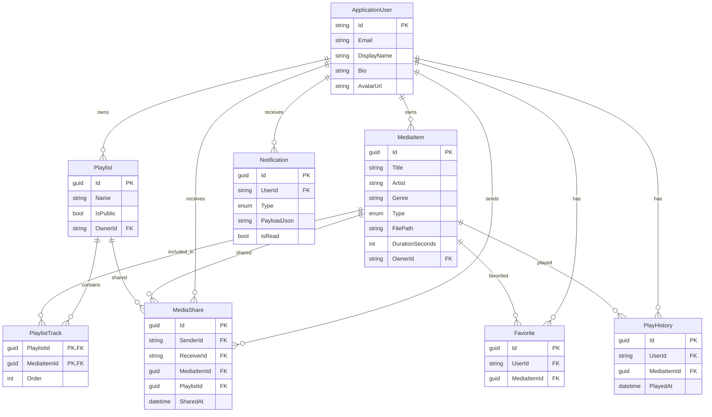

# TuneVault ERD

```mermaid
erDiagram
    ApplicationUser ||--o{ MediaItem : owns
    ApplicationUser ||--o{ Playlist : owns
    ApplicationUser ||--o{ MediaShare : sends
    ApplicationUser ||--o{ MediaShare : receives
    ApplicationUser ||--o{ Notification : receives
    ApplicationUser ||--o{ Favorite : has
    ApplicationUser ||--o{ PlayHistory : has

    Playlist ||--o{ PlaylistTrack : contains
    MediaItem ||--o{ PlaylistTrack : included_in
    MediaItem ||--o{ MediaShare : shared
    Playlist ||--o{ MediaShare : shared
    MediaItem ||--o{ Favorite : favorited
    MediaItem ||--o{ PlayHistory : played

    ApplicationUser {
        string Id PK
        string Email
        string DisplayName
        string Bio
        string AvatarUrl
    }

    MediaItem {
        guid Id PK
        string Title
        string Artist
        string Genre
        enum Type
        string FilePath
        int DurationSeconds
        string OwnerId FK
    }

    Playlist {
        guid Id PK
        string Name
        bool IsPublic
        string OwnerId FK
    }

    PlaylistTrack {
        guid PlaylistId PK,FK
        guid MediaItemId PK,FK
        int Order
    }

    MediaShare {
        guid Id PK
        string SenderId FK
        string ReceiverId FK
        guid MediaItemId FK
        guid PlaylistId FK
        datetime SharedAt
    }

    Notification {
        guid Id PK
        string UserId FK
        enum Type
        string PayloadJson
        bool IsRead
    }

    Favorite {
        guid Id PK
        string UserId FK
        guid MediaItemId FK
    }

    PlayHistory {
        guid Id PK
        string UserId FK
        guid MediaItemId FK
        datetime PlayedAt
    }
```
