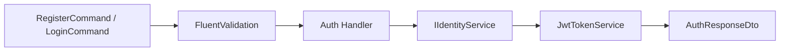
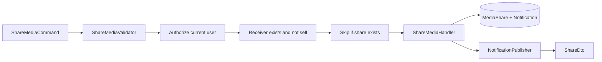
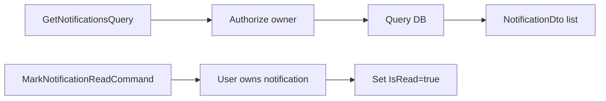
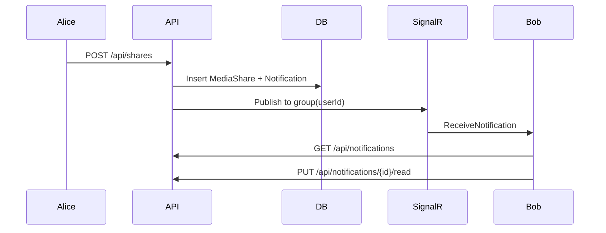

# Application Pipeline Diagrams

## 1. Authentication (Register / Login)

```mermaid
flowchart LR
    Request[RegisterCommand / LoginCommand] --> Validator[FluentValidation]
    Validator --> Handler[Auth Handler]
    Handler --> Identity[IIdentityService]
    Identity --> JWT[JwtTokenService]
    JWT --> Response[AuthResponseDto]
```

## 2. Share Media (mandatory flow)

```mermaid
flowchart LR
    Request[ShareMediaCommand] --> Validator[ShareMediaValidator]
    Validator --> AuthZ[Authorize current user]
    AuthZ --> CheckReceiver[Receiver exists and not self]
    CheckReceiver --> Idempotent[Skip if share exists]
    Idempotent --> Handler[ShareMediaHandler]
    Handler --> DB[(MediaShare + Notification)]
    Handler --> SignalR[NotificationPublisher]
    SignalR --> Response[ShareDto]
```

## 3. Notifications

```mermaid
flowchart LR
    Query[GetNotificationsQuery] --> AuthZ[Authorize owner]
    AuthZ --> Handler[Query DB]
    Handler --> DTO[NotificationDto list]

    Mark[MarkNotificationReadCommand] --> OwnerCheck[User owns notification]
    OwnerCheck --> Update[Set IsRead=true]
```

## Sequence: Share + Real-time notify

```mermaid
sequenceDiagram
    participant Alice
    participant API
    participant DB
    participant Hub as SignalR
    participant Bob

    Alice->>API: POST /api/shares
    API->>DB: Insert MediaShare + Notification
    API->>Hub: Publish to group(userId)
    Hub->>Bob: ReceiveNotification
    Bob->>API: GET /api/notifications
    Bob->>API: PUT /api/notifications/{id}/read
```
